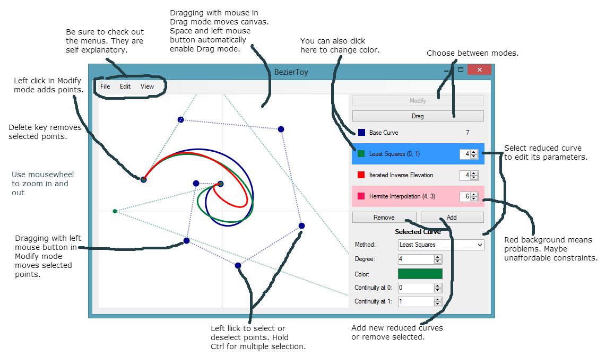

BezierToy
=========

BezierToy is visual tool showing different methods for Bezier curve degree reduction.
It was created as a home assignment during the Numerical Analysis 2 course held at
the Univerity of Wrocław in 2012/13.

The repository contains a Visual Studio solution created using the 2012 edition of VS.
There is also a Windows executable available under [releases](https://github.com/mkacz91/BezierToy/releases).

Exporting the curves to and from XML files is supported.

Problem
-------

Let n and m be integers such that m < n. We also have n + 1 control points defining
a Bezier curve in Berstein basis of degree n. The task is to produce m + 1 control
points such that the resulting m-degree curve approximates the original one as
closely as possible.

An additional constraint may be added that enforces certain class of continuity at the
endpoints of the curves, i.e., continuity class 0 means that the outermost control points
of both curves have to be identical, continuity class 1 enforces the tangents to match,
and so on.

Implemented Algorithms
----------------------

Four different solutions to the presented problem are implemented for comparison. Some of
of them support the continuity constraints.

**Iterated Inverse Elevation.** A polynomial curve of degree n can be represented exactly
in any Berstein basis that has a degree at least n. There is in fact a simple formula for
converting a representation in basis n to basis n + 1 without affecting the curve. By
simple transformation of this formula we get a degree _reduction_ method, which can be
applied repeadetly to reduce the degree by the desired amount. The quality of this method
is hard to determine. Careful implementation allows for continuity class 0 at the ends.

**Iterated Optimal.** Lowering the degree by _one_ can actually be done optimally in terms
of the uniform norm by noticing that the difference between the original curve and the
reduced one is a Chebyshev polynomial curve. Sadly, this isn't possible for greater
reductions but the method can be iterated. No contonuity class is guaranteed.

**Hermite Interpolation.** This method uses Hermite interpolation to find the interpolating
curve of degree m in evenly distributed nodes. Then, a conversion to Berstein basis is done.
Any continuity class can be imposed.

**Least Squares.** This method finds the optimal solution in terms of least squares
approximation. The version of the problem is most general, i.e., the degree m is arbitrary
and the continuity classes can be freely specified at both ends. Detailed description can be
found in in [P. Woźny, S. Lewanowicz, Multi-degree reduction of Bézier curves with constraints,
using dual Bernstein basis polynomials](http://www.sciencedirect.com/science/article/pii/S0167839609000260)
(I suppose, I can't legally link to a free version, sorry).

The algorithms' implementation source code is extensively commented, so you may want to
check it out as well.

Usage
-----

